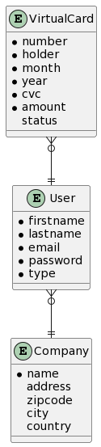

# Base de données

## Schéma Entité/Association (ou MCD)

Les sources (_plantUML_) permettant de générer ce schéma se trouve dans [le fichier schema.puml](./schema.puml)

## Modèle Physique de Données (MPD)

C'est un schéma ne représentant plus les entités, leurs propriétés et leurs associations, mais désormais le "réel", c'est-à-dire les tables et les champs (avec les primary keys et foreign keys).

Plus d'infos dans cette ressource : https://www.base-de-donnees.com/mpd/

## _Directus_

:warning: _Directus_ fournit déjà une entité pour les utilisateurs (et le système d'auth associé), il n'est donc pas nécessaire de créer la collection `User` dans ce cas précis
